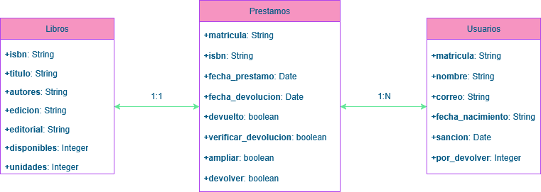

# Library Management REST API

This project implements a RESTful web service (REST API) in Java using the Spring Framework and Maven.  
It was developed as part of the **Service-Oriented Systems** course in the Computer Science degree.

> ⚠️ *Note*: Since the course is taught in Spanish, all source code, directories, and documentation are in Spanish.

---

## Overview

The service provides basic functionality for managing a library of books. In the following image we can see the entity-relationship model:



> *Note*: The relation ``books-loans`` is intended to be a one-one relationship but our implementation allows multiple loans per book as long as the book is available.

### REST API Design

The root URL of the service is `http://localhost:8080/biblioteca.api/`, and the following endpoints are available:

#### 📚 Books

- `GET /libros`
- `GET /libros/{isbn}`
- `GET /libros/{isbn}/unidades` – Number of available copies
- `GET /libros?titulo_contiene={titulo}` – Search by title
- `GET /libros?disponible={true|false}` – Search by availability
- `POST /libros`
- `PUT /libros/{isbn}`
- `DELETE /libros/{isbn}`

#### 📄 Loans

- `GET /prestamos`
- `GET /prestamos/{id}`
- `POST /prestamos`
- `PUT /prestamos/{id}` - Return book or verify loan (set ``devuelto`` attribute to ``true`` || set `verificar_devolucion` to ``true``)
- `DELETE /prestamos/{id}`

#### 👤 Users

- `GET /users`
- `GET /users/{matricula}` – Student ID
- `GET /users/{matricula}/prestamos` – Loans by student
- `PUT /users/{matricula}/prestamos/{id}` – Extend loan (set ``ampliar`` attribute to ``true``)
- `GET /users/{matricula}/actividad` – Student's activity
- `POST /users`
- `PUT /users/{matricula}`
- `DELETE /users/{matricula}`

All endpoints follow standard RESTful CRUD operations (`GET`, `POST`, `PUT`, `DELETE`).

---

### How it works

To run the project we use **Docker**. Since we have a ``Dockerfile`` and a `docker-compose.yaml` we can launch it using:

```bash
docker compose up -d
```

(or without `-d` flag). This will create *two containers*:

- One for the **application backend**, accessible from port `8080`.
- Another for the **PostgreSQL** database.

Then you can make the http requests using a tool like **Postman** or **Thunder Client**.
